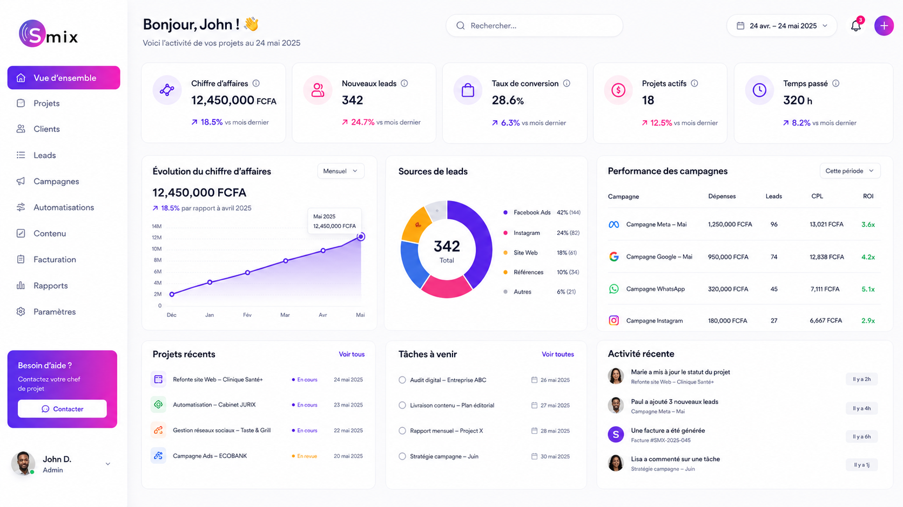

# 🚀 SMIX - Digital Growth & Automation Agency

## 📌 À propos

**SMIX** est une agence de croissance digitale et d'automatisation spécialisée dans l'accompagnement des PME africaines.  
Ce site vitrine présente nos services, nos packs tarifaires, nos études de cas et permet aux prospects de nous contacter directement via WhatsApp Business.

---

## ✨ Fonctionnalités

| Fonctionnalité | Description |
|----------------|-------------|
| 🎨 **Design premium** | Interface moderne inspirée des startups SaaS et agences IA |
| 📱 **100% responsive** | Parfait sur desktop, tablette et mobile |
| 💬 **WhatsApp Business intégré** | Bouton flottant + CTA personnalisés avec messages pré-remplis |
| 📊 **Simulateur de ROI** | Calcul interactif du retour sur investissement |
| 🎭 **Témoignages dynamiques** | Avis clients par service (affichage au clic) |
| 🔄 **Carrousel technologies** | Logo défilant des partenaires technologiques |
| 📈 **Compteurs animés** | Statistiques clés (PME accompagnées, projets IA, etc.) |
| 🧭 **Navigation fluide** | Ancres internes + bouton retour en haut |
| 🎯 **FAQ accordéon** | Questions fréquentes avec effet dépliant |

---

 # 🚀 SMIX - Digital Growth & Automation Agency

## 📌 À propos

**SMIX** est une agence de croissance digitale et d'automatisation spécialisée dans l'accompagnement des PME africaines.  
Ce site vitrine présente nos services, nos packs tarifaires, nos études de cas et permet aux prospects de nous contacter directement via WhatsApp Business.

🔗 **Lien du site** : [https://votre-username.github.io/smix-landing-page](https://votre-username.github.io/smix-landing-page)

---

## ✨ Fonctionnalités

| Fonctionnalité | Description |
|----------------|-------------|
| 🎨 **Design premium** | Interface moderne inspirée des startups SaaS et agences IA |
| 📱 **100% responsive** | Parfait sur desktop, tablette et mobile |
| 💬 **WhatsApp Business intégré** | Bouton flottant + CTA personnalisés avec messages pré-remplis |
| 📊 **Simulateur de ROI** | Calcul interactif du retour sur investissement |
| 🎭 **Témoignages dynamiques** | Avis clients par service (affichage au clic) |
| 🔄 **Carrousel technologies** | Logo défilant des partenaires technologiques |
| 📈 **Compteurs animés** | Statistiques clés (PME accompagnées, projets IA, etc.) |
| 🧭 **Navigation fluide** | Ancres internes + bouton retour en haut |
| 🎯 **FAQ accordéon** | Questions fréquentes avec effet dépliant |

---

## 🗂️ Structure du projet

---

## 🛠️ Technologies utilisées

| Technologie | Utilisation |
|-------------|-------------|
| HTML5 | Structure sémantique |
| TailwindCSS | Styling utilitaire rapide |
| JavaScript (Vanilla) | Animations, carrousel, FAQ, simulateur ROI |
| Font Awesome (SVG) | Icônes personnalisées |
| WhatsApp API | Liens directs vers WhatsApp Business |

---
